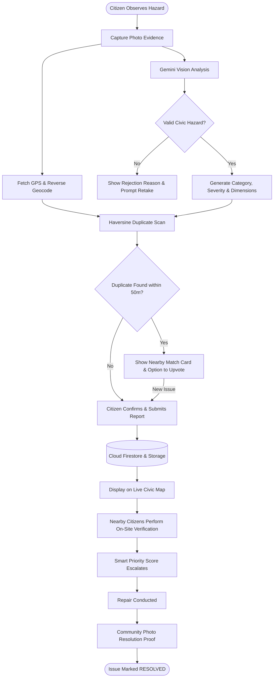
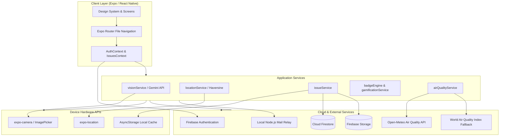

# CivicLens

> **See it. Snap it. Fix it.**
>
> A citizen-first civic intelligence platform that transforms real-world observations into structured, location-aware, community-verifiable civic issues.

[](https://reactnative.dev/)
[](https://expo.dev/)
[](https://www.typescriptlang.org/)
[](https://ai.google.dev/)
[](https://firebase.google.com/)
[](LICENSE)

---

## 📑 Table of Contents

- [Product Demo](#-product-demo)
- [Why CivicLens?](#-why-civiclens)
- [What Makes CivicLens Different?](#-what-makes-civiclens-different)
- [Detailed Features](#-detailed-features)
- [AI Layer & Vision Pipeline](#-ai-layer--vision-pipeline)
- [End-to-End Workflow](#-end-to-end-workflow)
- [Architecture](#-architecture)
- [Tech Stack](#-tech-stack)
- [Application Structure](#-application-structure)
- [Design System](#-design-system)
- [Getting Started](#-getting-started)
- [Firebase Configuration](#-firebase-configuration)
- [Google Maps Configuration](#-google-maps-configuration)
- [Testing & Verification](#-testing--verification)
- [Runtime & Offline Resilience](#-runtime--offline-resilience)
- [Security](#-security)
- [Engineering Highlights](#-engineering-highlights)
- [Roadmap](#-roadmap)
- [Project Status & Limitations](#-project-status--limitations)
- [Author](#-author)
- [License](#-license)

---

## 🎥 Product Demo

A comprehensive **51-second end-to-end product demonstration** showcasing the complete CivicLens mobile experience is available in the repository root:

* **File:** [`CivicLens_Product_Demo.mp4`](CivicLens_Product_Demo.mp4)
* **Capture Source:** Google Pixel 7 Android Emulator (Android 14 / API 34)
* **Viewport Resolution:** Native **1080 × 2400** vertical viewport (9:20 aspect ratio)
* **Framing:** Pure mobile device screen capture via Android ADB hardware framebuffer — zero IDE, taskbar, browser tabs, or emulator window chrome visible
* **Subtitles:** Floating high-contrast status overlays burned directly into the stream, guiding the viewer through each screen

```
00:00 - 00:06  Live Civic Issue Map (Interactive map, search bar, active status counters, and floating incident card)
00:06 - 00:15  View Issue Details (Priority rating 59/100, AI intel, impact timeline, citizen confirmations)
00:15 - 00:23  Capture Evidence & Report (Photo picker, category selector, severity gauge, GPS telemetry)
00:23 - 00:32  District Telemetry & Spotdex (56% Health Index, AQI 110 telemetry, rainfall & noise tracking)
00:32 - 00:38  Civic Logbook (Active & Resolved status filters, complete personal report tracking)
00:38 - 00:44  Leaderboard & Trust (Top citizen rankings, podium standings, trust ratings)
00:44 - 00:48  Citizen Profile & Badges (Contribution heatmap, unlockable achievements, verified level)
00:48 - 00:51  Return to Live Map (Clean overview with 3-second closing hold)
```

> **Demo Video Link:** Download or inspect [`CivicLens_Product_Demo.mp4`](CivicLens_Product_Demo.mp4) directly in your local workspace or video player.

---

## 💡 Why CivicLens?

### The Civic Infrastructure Problem
Public infrastructure decay—potholes, open trash accumulation, non-functioning streetlights, and damaged road surfaces—often goes unreported or gets buried in bureaucratic backlogs. Traditional reporting mechanisms suffer from three critical bottlenecks:

1. **High Citizen Friction:** Generic web forms require citizens to manually categorize complex civic issues, enter postal addresses, and fill lengthy questionnaires.
2. **Duplicate Avalanche:** When a major pothole opens on an arterial road, dozens of citizens file duplicate complaints, fragmenting municipal response logs and wasting triage hours.
3. **Black-Hole Feedback:** Once submitted, reports offer zero status visibility, eroding community trust and discouraging future civic participation.

### The CivicLens Lifecycle
CivicLens replaces unstructured complaint boxes with a closed-loop civic intelligence pipeline:

$$\text{Observe} \longrightarrow \text{Report} \longrightarrow \text{Verify} \longrightarrow \text{Track} \longrightarrow \text{Resolve}$$

* **Observe:** Citizen spots an on-ground hazard.
* **Report:** Camera snapshot with automatic GPS capture and assistive AI categorization.
* **Verify:** Nearby citizens cross-verify the report on-site to validate active conditions.
* **Track:** Transparent 5-stage lifecycle and priority weighting keep everyone informed.
* **Resolve:** Community confirmation with visual resolution proof closes the loop.

---

## ⚡ What Makes CivicLens Different?

* **AI-Assisted Reporting:** Multimodal vision analysis suggests categories, severity, and estimated hazard dimensions (e.g., width & depth in cm) before submission, while keeping the citizen in full control.
* **Geospatial Location Intelligence:** Instant high-accuracy GPS lock coupled with automatic reverse geocoding to human-readable street names.
* **Algorithmic Duplicate Prevention:** Real-time spatial proximity scanning using the Haversine distance formula warns reporters if a matching hazard has already been logged nearby.
* **Community Verification Engine:** Citizens within proximity confirm whether an issue still exists, preventing stale tickets and prioritizing high-impact hazards.
* **Civic Reputation & Gamification:** A multi-tiered trust rating, contribution streak calendar, and 40+ unlockable civic badges reward constructive neighborhood stewardship.
* **District Environmental Telemetry (Spotdex):** Live environmental telemetry including real-time US Air Quality Index (AQI), particulate matter ($PM_{2.5}$ / $PM_{10}$), rainfall tracking, and aggregate District Health scoring.

---

## 📱 Detailed Features

### 1. Live Civic Issue Map
* **Interactive Map Surface:** Built with `react-native-maps`, rendering custom category pins across the user's geographic region.
* **Real-Time Category Filtering:** Filter pins dynamically by Potholes, Waste, Lighting, Road Damage, or General Hazards.
* **Status Toggles:** Filter between active hazards and verified resolved community milestones.
* **Floating Incident Preview:** Swipeable bottom card stack previewing issue photographs, distance, severity badges, and community confirmation counts without leaving the map.

### 2. Smart Issue Reporting Flow
* **Visual Evidence Capture:** Seamless integration with `expo-camera` and `expo-image-picker` supporting photo capture, replacement, and thumbnail previews.
* **Automated Image Optimization:** On-device compression via `expo-image-manipulator` (max 600px width, 60% JPEG quality) ensuring sub-second inference and low data consumption.
* **Reverse Geocoding:** Auto-resolves latitude and longitude into street and municipal neighborhood names via `expo-location`.
* **Proximity Duplicate Detection:** Scans existing active issues within a configurable 50-meter radius using the Haversine great-circle formula, presenting a match card before duplicate submission.
* **Severity Selector:** Granular severity levels (Low, Medium, High) with contextual color highlights.

### 3. Issue Details & 5-Stage Lifecycle
* **Evidence Gallery:** Full-bleed photo inspection with timestamp and reporting citizen attribution.
* **Smart Priority Score (0–100):** Dynamic weighted score calculated from severity weight (30%), traffic level (20%), community confirmations (20%), ticket age (15%), and road importance (15%).
* **Structured Lifecycle Timeline:** Five distinct progression states:
  1. *Report Submitted* (Logged with GPS & Photo evidence)
  2. *AI Vision Analysis* (Confidence rating and dimension estimates)
  3. *Community Verified* (Nearby citizens confirmed active state)
  4. *High-Priority Alert / Watch* (Dynamic priority calculation)
  5. *Issue Resolved* (Closed with photographic community confirmation)
* **On-Site Verification:** "Still Exists" confirmation button that increments verification counters and updates the issue's priority score.
* **Resolution Proof:** Community members can confirm hazard repairs, transitioning the issue to `RESOLVED` once the community threshold is reached.

### 4. Spotdex: District Environmental Telemetry
* **District Health Index:** Real-time percentage composite reflecting the ratio of resolved vs. active neighborhood issues.
* **Live Air Quality Index (AQI):** Fetches real-time US AQI, $PM_{2.5}$, and $PM_{10}$ concentration readings from the Open-Meteo Air Quality API with automated fallback to the World Air Quality Index (WAQI).
* **Health Recommendations:** Actionable advisories based on particulate levels (e.g., N95 mask recommendations during poor air quality periods).
* **Environmental Telemetry:** Rainfall depth gauges, temperature status, and district risk categorization.

### 5. Civic Logbook
* **Personal Contribution Tracker:** Centralized history of all issues submitted by the logged-in citizen.
* **Status Segmentation:** Quick filter chips for *All*, *Active*, and *Resolved* reports.
* **Metric Summary Cards:** Quick count metrics for total contributions, pending verifications, and resolved issues.

### 6. Leaderboard & Civic Trust
* **Community Rankings:** Real-time leaderboard aggregating citizen contributions from Cloud Firestore.
* **Podium Standings:** Distinct visual highlight for top-3 neighborhood contributors.
* **Trust Score (0–100):** Weighted civic reliability rating earned through accurate submissions and community confirmations.
* **Citizen Levels:** Progression tier from *Novice Scout* (Level 1) through *Civic Legend* (Level 5).

### 7. Citizen Profile & Gamification Engine
* **Activity Streak Heatmap:** Multi-day activity streak tracker encouraging consistent neighborhood monitoring.
* **Achievement System:** 48 tiered civic badges across 8 categories (Onboarding, Road Hazards, Night Lighting, Waste, Verifications, Restorations, Streaks, and Century Milestones).
* **Privacy Controls:** Configurable public profile visibility, anonymous reporting options, and location precision preferences.

---

## 🧠 AI Layer & Vision Pipeline

CivicLens uses an assistive multimodal vision pipeline powered by the **Google Gemini Multimodal Vision API** (`gemini-3.5-flash` / `gemini-flash-latest`) to eliminate manual triage while keeping the citizen in full control.

### Triage Pipeline
```text
  [Photo Captured]
         │
         ▼
[expo-image-manipulator] ──> Resized (600px width, 60% JPEG, Base64)
         │
         ▼
[Google Gemini Vision API]
         │
         ├── Quality Check ──> [Reject if selfie / indoor / non-civic / pitch black]
         │
         └── Hazard Analysis
                 ├── Classification ('pothole' | 'garbage' | 'streetlight' | 'road_damage' | 'other')
                 ├── Confidence Score (0.75 - 0.99)
                 ├── Severity Suggestion ('low' | 'medium' | 'high')
                 ├── Dimensional Estimates (Estimated Depth & Width in cm)
                 └── Structured Description
         │
         ▼
[Citizen Review Card] ──> Citizen inspects, adjusts if necessary, and confirms
         │
         ▼
[Structured Report Created]
```

### Safety & Quality-Control Validation
The vision model acts as a first-line filter to prevent spam and invalid reports:
* **Automatic Rejections:** Non-civic photographs (selfies, portraits, indoor rooms, vehicles, pets, food, solid dark screens, or undamaged pavement) are identified with a friendly explanatory rejection notice.
* **Hazard Dimension Estimation:** Estimates approximate pothole depth and crater width in centimeters (e.g., `Width ~48 cm • Depth ~14 cm`), giving municipal road crews actionable sizing data prior to dispatch.
* **Assistive, Not Autocratic:** The AI suggestion is presented as a card. The reporter can accept the suggestion or manually override category, severity, and description at any time.

---

## 🔄 End-to-End Workflow



---

## 🏗️ Architecture



---

## 🧰 Tech Stack

| Area | Technology | Purpose |
| :--- | :--- | :--- |
| **Framework** | React Native 0.81.5 | Cross-platform mobile foundation |
| **Tooling** | Expo SDK 54.0.0 | Toolchain, build ecosystem, and native runtime |
| **Language** | TypeScript 5.3.3 | Strict type safety across components and domain models |
| **Routing** | Expo Router 6.0.24 | File-system-based typed navigation |
| **Mapping** | `react-native-maps` 1.20.1 | Native Google Maps rendering and custom marker overlays |
| **Location** | `expo-location` 19.0.8 | Foreground GPS positioning and reverse geocoding |
| **Camera & Media** | `expo-camera`, `expo-image-picker` | Photo capture and gallery selection |
| **Image Pipeline** | `expo-image-manipulator` | Client-side compression, resizing, and Base64 encoding |
| **AI Vision** | Google Gemini Multimodal API | Zero-shot visual classification, QC checks, and dimension sizing |
| **Authentication** | Firebase Authentication 11.4.0 | User authentication and session persistence |
| **Database** | Cloud Firestore | Real-time NoSQL storage for issues, verifications, and user profiles |
| **Cloud Storage** | Firebase Storage | Scalable cloud bucket storage for incident photographs |
| **Environmental API** | Open-Meteo Air Quality API | Live real-time US AQI, $PM_{2.5}$, and $PM_{10}$ telemetry |
| **Local Persistence** | `@react-native-async-storage` | Offline issue caching and resilience fallback |
| **Icons** | `lucide-react-native` | Consistent, accessible iconography |
| **Build & Release** | EAS (Expo Application Services) | Standalone Android APK generation |

---

## 📁 Application Structure

```text
├── app/                              # Expo Router file-system routes
│   ├── (auth)/                       # Authentication flows (login, register)
│   ├── (tabs)/                       # Main bottom-tab navigation screens
│   │   ├── index.tsx                 # Live Civic Issue Map & HUD
│   │   ├── spotdex.tsx               # District Health & Environmental Telemetry
│   │   ├── report.tsx                # Smart Issue Reporting & AI Vision
│   │   ├── reports.tsx               # Civic Logbook & Report Tracking
│   │   ├── leaderboard.tsx           # District Leaderboard & Citizen Standings
│   │   └── profile.tsx               # Citizen Profile, Streak Heatmap & Badges
│   ├── issue/
│   │   └── [id].tsx                  # Dynamic issue details & 5-stage lifecycle
│   └── _layout.tsx                   # Global navigation provider & root layout
│
├── components/                       # Modular reusable UI components
│   ├── cards/                        # CivicIssueCard, IssueCompactCard, SwipeableCardStack
│   ├── gamification/                 # AchievementModal, AllBadgesModal, BadgeDetailModal
│   ├── issue/                        # IssueTimeline, ResolutionPhotoModal
│   ├── map/                          # CivicMapView, IssueMarker, MapIssueCarousel
│   ├── report/                       # AiSuggestionCard, DuplicateAlertModal, LocationPreviewCard
│   ├── ui/                           # CategoryBadge, StatusBadge, EmptyState, ModernAlertModal
│   └── widgets/                      # ActivityStreamWidget, CivicPulseWidget
│
├── constants/                        # Static application definitions
│   ├── badges.ts                     # 48 Civic badge criteria, icons, and tiers
│   ├── categories.ts                 # Category definitions, colors, and metadata
│   ├── mockData.ts                   # Initial verified dataset for offline fallback
│   ├── severities.ts                 # Severity levels and color scales
│   └── theme.ts                      # CivicLens Design System tokens
│
├── contexts/                         # React state providers
│   ├── AuthContext.tsx               # User authentication and demo user switching
│   └── IssuesContext.tsx             # Issue state, live listener sync, and CRUD actions
│
├── services/                         # External integrations & business logic
│   ├── ai/visionService.ts           # Gemini Vision API integration and fallback
│   ├── analytics/airQualityService.ts# Open-Meteo & WAQI real-time telemetry
│   ├── auth/authService.ts           # Firebase Auth wrappers
│   ├── firebase/config.ts            # Firebase app initialization and offline check
│   ├── gamification/badgeEngine.ts   # Badge calculation and reputation tracking
│   ├── issues/issueService.ts        # Firestore issue queries and caching
│   ├── location/locationService.ts   # GPS retrieval and reverse geocoding
│   └── storage/storageService.ts     # Firebase Storage image upload
│
├── server/
│   └── mailServer.js                 # Lightweight Node.js SMTP/mailer relay service
├── types/                            # Domain TypeScript definitions (issue, user, gamification)
├── utils/                            # Shared algorithms
│   ├── distance.ts                   # Haversine distance formula & duplicate detection
│   ├── formatters.ts                 # Date, time, and coordinate formatters
│   └── priority.ts                   # Multi-variable Smart Priority Score calculation
└── app.json                          # Expo configuration manifest
```

---

## 🎨 Design System

CivicLens was redesigned with a **calm civic utility** aesthetic. Public utility software should feel fast, dependable, clear, and modern—avoiding chaotic gradients and sensory overload in favor of crisp typography and intentional hierarchy.

### Color Palette

| Token | Hex | Usage |
| :--- | :--- | :--- |
| `primary` | `#1D4ED8` | Action buttons, active tabs, primary brand identity |
| `primaryDark` | `#1E3A8A` | Deep contrast headers and pressed button states |
| `primaryGradientEnd` | `#1E40AF` | Gradient elevation accents |
| `surfaceDark` / `textPrimary` | `#0F172A` | Slate 900 high-legibility typography and dark cards |
| `background` | `#F8FAFC` | Clean Slate 50 background canvas |
| `border` | `#E2E8F0` | Subtle Slate 200 structural dividers and card outlines |
| `success` / `resolved` | `#059669` | Emerald 600 resolved status and healthy telemetry |
| `warning` / `medium` | `#D97706` | Amber 600 medium hazard ratings |
| `error` / `high` | `#DC2626` | Ruby 600 critical severity indicators |

### Core Design Principles
* **Mobile-First Utility:** Touch targets conform to a minimum $44 \times 44$ dp grid with comfortable thumb reach zones.
* **Structured Information Hierarchy:** Overline category tags, bold primary headers, and muted timestamps ensure quick scanning during mobile field use.
* **Component Modularity:** Strict separation between atomic badges (`StatusBadge`, `CategoryBadge`), compound cards (`CivicIssueCard`), and navigational screens.
* **Quiet Intelligence:** System alerts and AI suggestions are presented through floating glass cards and non-blocking notification banners.

---

## 🚀 Getting Started

### Prerequisites
* **Node.js:** v18.0.0 or higher
* **Package Manager:** `npm` (included with Node.js)
* **Android Studio / Android SDK:** (For running the Android Emulator)
* **Expo Go App:** (Optional, for running on a physical Android device)
* **Git:** Installed on your development machine

### 1. Clone the Repository
```bash
git clone https://github.com/Jyatin/-fixmyway.git
cd -fixmyway
```

### 2. Install Dependencies
```bash
npm install
```

### 3. Environment Configuration
Create a `.env` file in the project root based on `.env.example`:
```bash
cp .env.example .env
```
Populate the environment variables with your API keys (see [Firebase Configuration](#-firebase-configuration) and [Google Maps Configuration](#-google-maps-configuration) below).

### 4. Start the Development Server
```bash
npx expo start
```

### 5. Launch on Android Emulator
1. Start an Android Virtual Device (AVD) from Android Studio (e.g., Pixel 7, API 34).
2. Press `a` in the interactive Expo terminal, or execute:
   ```bash
   npx expo start --android
   ```

### 6. Standalone Android APK Build (EAS)
To create an installable `.apk` bundle for testing on physical devices:
```bash
npx eas-cli login
npx eas-cli build -p android --profile preview
```

---

## 🔐 Firebase Configuration

CivicLens uses Firebase for identity, real-time data, and photo evidence storage.

### Required Firebase Services
1. **Firebase Authentication:** Enable *Email/Password* and *Anonymous* sign-in providers in the Firebase Console.
2. **Cloud Firestore Database:** Create a Firestore database in production mode and deploy the security rules provided in [`firestore.rules`](firestore.rules).
3. **Firebase Storage:** Enable Cloud Storage to store uploaded issue evidence photos under the `/issues` path.

### Environment Setup (`.env`)
```bash
EXPO_PUBLIC_FIREBASE_API_KEY=your_firebase_api_key
EXPO_PUBLIC_FIREBASE_AUTH_DOMAIN=your_project.firebaseapp.com
EXPO_PUBLIC_FIREBASE_PROJECT_ID=your_project_id
EXPO_PUBLIC_FIREBASE_STORAGE_BUCKET=your_project.firebasestorage.app
EXPO_PUBLIC_FIREBASE_MESSAGING_SENDER_ID=your_messaging_sender_id
EXPO_PUBLIC_FIREBASE_APP_ID=your_firebase_app_id
```

> **Security Note:** Never commit `.env` or service-account credential files to source control. Ensure `.env` is listed in your [`.gitignore`](.gitignore).

---

## 🗺️ Google Maps Configuration

CivicLens uses native Google Maps via `react-native-maps` on Android:

1. Obtain a **Google Maps SDK for Android** key from the [Google Cloud Console](https://console.cloud.google.com/).
2. In Google Cloud Console, restrict the API key to your Android package name (`com.fixmyway.app`) and SHA-1 certificate fingerprint.
3. Configure the key in `.env`:
   ```bash
   EXPO_PUBLIC_GOOGLE_MAPS_API_KEY=your_google_maps_android_api_key
   ```
4. In `app.json`, the key is injected into `android.config.googleMaps.apiKey`.

---

## ✅ Testing & Verification

The complete application was verified via automated and manual smoke tests on a **Google Pixel 7 Android Emulator (Android 14 / API 34)**:

| Screen / Feature Area | Verified Capabilities | Test Result |
| :--- | :--- | :---: |
| **Live Civic Map** | Marker pin rendering, category filtering, search input, floating card stack carousel | **PASS** |
| **Issue Details** | Photo rendering, priority gauge (59/100), AI classification badges, 5-stage timeline | **PASS** |
| **Smart Report Flow** | Photo capture, Gemini Vision classification, category selection, GPS lock, duplicate alert | **PASS** |
| **Spotdex Telemetry** | District Health percentage (56%), live Open-Meteo AQI (110), PM2.5/PM10 metrics | **PASS** |
| **Civic Logbook** | All/Active/Resolved filter tabs, contribution count cards, issue card rendering | **PASS** |
| **District Leaderboard** | Top-3 podium visualization, citizen ranking table, live trust score aggregation | **PASS** |
| **Citizen Profile** | Level progression, contribution streak heatmap, badge unlock preview, privacy modal | **PASS** |

---

## 🛡️ Runtime & Offline Resilience

Mobile applications operated by field scouts face variable network coverage, DNS limits, and intermittent cellular handoffs. CivicLens is architected with non-blocking fallbacks across all critical paths:

1. **Database Fallback:** If Cloud Firestore is unreachable or encounters network timeout, `issueService.ts` seamlessly serves pre-seeded and cached issues from local `AsyncStorage` (`@civiclens_issues_cache_v6`).
2. **AI Vision Fallback:** If the Google Gemini endpoint is unreachable, `visionService.ts` falls back to a deterministic heuristic classifier that infers category and hazard dimensions from local metadata, preventing submission failures.
3. **Telemetry Fallback:** If the primary Open-Meteo endpoint fails, `airQualityService.ts` attempts a secondary WAQI ground station request before falling back to a safe regional particulate baseline.
4. **Location Fallback:** If GPS access is denied or satellite acquisition times out, `locationService.ts` loads the last known cached position or safe district coordinates with an informative banner.

---

## 🔒 Security

* **Credential Protection:** All private keys and service credentials are kept strictly out of Git tracking. Only public client identifiers are passed via Expo environment bindings.
* **Firestore Security Rules:** Enforce schema validation and user authorization in [`firestore.rules`](firestore.rules):
  * Issues can only be deleted by the original reporting citizen.
  * Community verifications and resolutions require authenticated citizen tokens.
  * User profile writes are restricted strictly to `request.auth.uid == userId`.
* **Client-Side Photo Stripping:** Images are compressed and stripped of extraneous EXIF metadata on-device before upload to protect reporter privacy.
* **Granular Privacy Settings:** Citizens can toggle public display names, leaderboard participation, and approximate GPS masking directly in profile preferences.

---

## 🏆 Engineering Highlights

* **Cross-Platform React Native Architecture:** Leverages modern React 19 and Expo SDK 54 with strict TypeScript typing across all models, services, and hooks.
* **Haversine Proximity Calculations:** Efficient client-side distance computation ($O(N)$ filter pass) to catch duplicate submissions within a 50-meter radius before network dispatch.
* **Dynamic Multi-Variable Priority Algorithm:** Algorithmic prioritization incorporating severity, traffic exposure, ticket age, and on-site citizen confirmations into a 0–100 score.
* **Multimodal Vision Integration:** On-device image compression and structured JSON prompting with Google Gemini Flash for real-time hazard classification and dimension estimation.
* **Clean State Architecture:** Context-driven reactive state (`IssuesContext`, `AuthContext`) combined with asynchronous storage caching for instantaneous perceived performance.

---

## 🗺️ Roadmap

### Phase 1: Core Foundation ✅
- [x] Complete React Native + Expo mobile application architecture.
- [x] Interactive Google Maps with custom category pins and filter HUD.
- [x] Camera capture, gallery selection, and on-device photo compression.
- [x] Haversine-based duplicate issue detection.
- [x] 5-stage community verification and resolution lifecycle.
- [x] District Leaderboard and 48-badge gamification engine.

### Phase 2: Civic Intelligence ✅
- [x] Multimodal Google Gemini Vision API for automatic classification and dimension sizing.
- [x] Live Open-Meteo Air Quality telemetry and District Health scoring.
- [x] Modernized CivicLens 2.0 design system.
- [x] Verified Pixel 7 Android emulator testing and recorded product demo.

### Phase 3: Production Hardening 🔄
- [ ] End-to-end push notifications via Expo Notifications for issue resolution alerts.
- [ ] Offline SQLite database sync for extended zero-connectivity scouting trips.
- [ ] Automated Jest unit test suite covering priority calculations and geospatial utils.

### Phase 4: City-Scale Intelligence 🔮
- [ ] Integration with municipal Open311 standard civic API endpoints.
- [ ] Automated satellite and Street View change detection for resolved road hazards.
- [ ] District-level analytics web dashboard for public works administrative review.

---

## 📌 Project Status & Limitations

CivicLens is currently an **active hackathon-tested civic technology prototype**. It demonstrates a complete, verified mobile workflow from on-ground hazard capture to community resolution.

### Current Limitations
* **Municipal Dispatch:** CivicLens does not currently link directly to live government dispatch or municipal work-order databases; reports are maintained within the community cloud database.
* **Network Requirements:** Live AI vision analysis, Firebase cloud syncing, and AQI telemetry require an active internet connection (gracefully utilizing local fallbacks when disconnected).
* **Maps API Keys:** Running the Google Maps native provider on physical Android devices requires a configured and restricted Google Maps API key in your environment.

---

## 👨‍💻 Author

**Jyatin Singh**

* **GitHub:** [@Jyatin](https://github.com/Jyatin)
* **LeetCode:** [@Jyatin_singh](https://leetcode.com/u/Jyatin_singh/)

---

## 📄 License

This project is open-source under the **MIT License**. See the [LICENSE](LICENSE) file for complete details.
