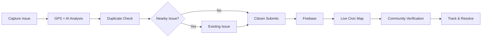
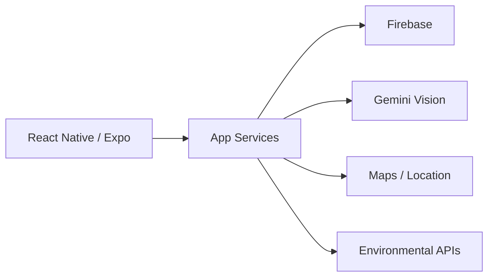

# FixMyWay — AI-Assisted Civic Issue Reporting

> **See it. Snap it. Fix it.**

FixMyWay is a React Native + Expo app for reporting and tracking civic issues such as potholes, waste, road damage, and broken streetlights. It combines AI image analysis, GPS, geospatial duplicate detection, community verification, and Firebase.

## 🎥 Product Showcase

- 📱 [Vertical 9:16 Demo](FixMyWay_LinkedIn_Showcase.mp4)
- 🖥️ [Landscape 16:9 Demo](FixMyWay_LinkedIn_Showcase_16x9.mp4)
- [Direct video](https://raw.githubusercontent.com/Jyatin/-fixmyway/main/FixMyWay_LinkedIn_Showcase.mp4)

## ✨ Key Features

- **AI-assisted reporting** — category, severity, and approximate dimensions.
- **GPS & reverse geocoding** — location and readable addresses.
- **Duplicate detection** — Haversine-based nearby issue detection.
- **Community verification** — citizens confirm reported issues.
- **Issue tracking** — submission → verification → resolution.
- **Live civic map** — category and status filters.
- **Gamification** — trust score, streaks, levels, and badges.
- **Environmental telemetry** — AQI, rainfall, and district data.

## 🧠 AI Pipeline

```text
Photo → Optimization → Gemini Vision → Category / Severity / Dimensions → Citizen Review → Civic Report
```

## 🔄 End-to-End Workflow


```mermaid
flowchart LR
    A[Capture Issue] --> B[GPS + AI Analysis]
    B --> C[Duplicate Check]
    C --> D{Nearby Issue?}
    D -->|Yes| E[Existing Issue]
    D -->|No| F[Citizen Submits]
    E --> F
    F --> G[Firebase]
    G --> H[Live Civic Map]
    H --> I[Community Verification]
    I --> J[Track & Resolve]
```

## 🏗️ Architecture


```mermaid
graph LR
    A[React Native / Expo] --> B[App Services]
    B --> C[Firebase]
    B --> D[Gemini Vision]
    B --> E[Maps / Location]
    B --> F[Environmental APIs]
```

## 🛠️ Tech Stack

| Area | Technology |
|---|---|
| Mobile | React Native, Expo |
| Language | TypeScript |
| Navigation | Expo Router |
| Backend / Database | Firebase Auth, Firestore, Storage |
| Maps & Location | Google Maps, `react-native-maps`, Expo Location |
| AI | Google Gemini Vision API |
| Environmental Data | Open-Meteo Air Quality API |

## 📁 Application Structure

```text
├── app/                         # Screens and routes
│   ├── (auth)/                  # Authentication
│   ├── (tabs)/                  # Main app tabs
│   ├── issue/[id].tsx           # Issue details
│   └── _layout.tsx              # Navigation layout
├── components/                  # Reusable UI
│   ├── cards/                   # Issue/report cards
│   ├── gamification/            # Badges and achievements
│   ├── issue/                   # Issue components
│   ├── map/                     # Maps and markers
│   ├── report/                  # AI/reporting UI
│   ├── ui/                      # Shared primitives
│   └── widgets/                 # Dashboard widgets
├── constants/                   # App constants and theme
├── contexts/                    # Auth and issue state
├── services/                    # AI, Firebase, location, business logic
├── server/                      # Mail relay
├── types/                       # TypeScript models
├── utils/                       # Utility functions
├── assets/                      # App assets
├── app.json                     # Expo configuration
└── .env.example                 # Environment template
```

## 🚀 Getting Started

```bash
git clone https://github.com/Jyatin/-fixmyway.git
cd -fixmyway
npm install
cp .env.example .env
npx expo start
```

Configure Firebase, Google Maps, and Gemini environment variables.

### Android Build

```bash
npx eas-cli login
npx eas-cli build -p android --profile preview
```

## 📱 Application Flow

1. Sign in → 2. Explore map → 3. Capture issue → 4. AI/GPS analysis → 5. Duplicate check → 6. Submit → 7. Community verification → 8. Track resolution.

## 📌 Project Status

Actively developed civic-tech project demonstrating **mobile development, AI integration, geospatial algorithms, Firebase, and modern mobile UX**.

## 👨‍💻 Author

**Jyatin Kumar Singh** — B.Tech CSE, Full Stack Development

- GitHub: https://github.com/Jyatin
- LinkedIn: https://www.linkedin.com/in/jyatinsingh/

## 📄 License

MIT License
