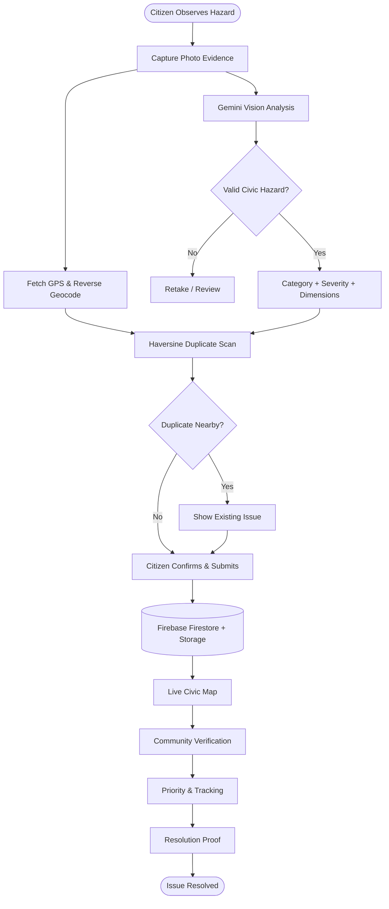
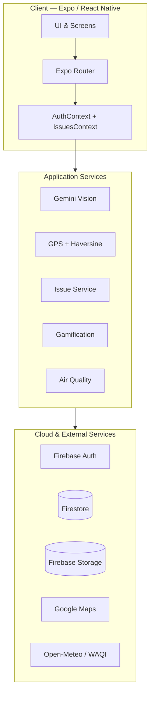

# FixMyWay — AI-Assisted Civic Issue Reporting

> **See it. Snap it. Fix it.**

FixMyWay is a React Native + Expo mobile app for reporting, verifying, and tracking civic issues such as potholes, waste, road damage, and broken streetlights.

It combines **AI-assisted image analysis, GPS, geospatial duplicate detection, community verification, and Firebase** to turn citizen reports into structured, trackable civic issues.

## 🎥 Product Showcase

Real running Android application demonstration:

- 📱 [Vertical 9:16 Demo](FixMyWay_LinkedIn_Showcase.mp4)
- 🖥️ [Landscape 16:9 Demo](FixMyWay_LinkedIn_Showcase_16x9.mp4)
- [Direct video](https://raw.githubusercontent.com/Jyatin/-fixmyway/main/FixMyWay_LinkedIn_Showcase.mp4)

## ✨ Key Features

- **AI-assisted reporting** — suggests issue category, severity, and approximate dimensions from photos.
- **GPS & reverse geocoding** — captures location and converts coordinates into readable addresses.
- **Duplicate detection** — uses the Haversine formula to identify nearby reports.
- **Community verification** — nearby citizens can confirm whether an issue still exists.
- **Issue lifecycle tracking** — follows reports from submission through verification and resolution.
- **Live civic map** — displays issues with category and status filters.
- **Civic profile & gamification** — contribution history, trust score, streaks, levels, and badges.
- **Environmental telemetry** — district health, AQI, rainfall, and related data.

## 🧠 AI Pipeline

```text
Photo
  ↓
Image Optimization
  ↓
Gemini Vision Analysis
  ↓
Category + Severity + Dimensions
  ↓
Citizen Review
  ↓
Structured Civic Report
```

The AI is **assistive**: users review and can modify the suggested category, severity, and description before submission.

## 🔄 End-to-End Workflow


```mermaid
flowchart TD
    A([Citizen Observes Hazard]) --> B[Capture Photo Evidence]
    B --> C[Fetch GPS & Reverse Geocode]
    B --> D[Gemini Vision Analysis]
    D --> E{Valid Civic Hazard?}
    E -- No --> F[Retake / Review]
    E -- Yes --> G[Category + Severity + Dimensions]
    C --> H[Haversine Duplicate Scan]
    G --> H
    H --> I{Duplicate Nearby?}
    I -- Yes --> J[Show Existing Issue]
    I -- No --> K[Citizen Confirms & Submits]
    J --> K
    K --> L[(Firebase Firestore + Storage)]
    L --> M[Live Civic Map]
    M --> N[Community Verification]
    N --> O[Priority & Tracking]
    O --> P[Resolution Proof]
    P --> Q([Issue Resolved])
```

## 🏗️ Architecture


```mermaid
graph TB
    subgraph Client["Client — Expo / React Native"]
        UI[UI & Screens]
        Router[Expo Router]
        Context[AuthContext + IssuesContext]
    end

    subgraph Services["Application Services"]
        AI[Gemini Vision]
        Geo[GPS + Haversine]
        Issues[Issue Service]
        Game[Gamification]
        AQI[Air Quality]
    end

    subgraph Cloud["Cloud & External Services"]
        Auth[Firebase Auth]
        DB[(Firestore)]
        Storage[(Firebase Storage)]
        Maps[Google Maps]
        Env[Open-Meteo / WAQI]
    end

    UI --> Router --> Context
    Context --> Services
    Services --> Cloud
```

## 🛠️ Tech Stack

| Area | Technology |
|---|---|
| Mobile | React Native, Expo |
| Language | TypeScript |
| Navigation | Expo Router |
| Backend / Database | Firebase Auth, Firestore, Storage |
| Maps & Location | Google Maps, `react-native-maps`, Expo Location |
| AI | Google Gemini Vision API |
| Environmental Data | Open-Meteo Air Quality API |

## 📁 Application Structure

```text
├── app/                         # Expo Router screens and routes
│   ├── (auth)/                  # Login and registration
│   ├── (tabs)/                  # Main application tabs
│   │   ├── index.tsx            # Live civic issue map
│   │   ├── spotdex.tsx          # Environmental telemetry
│   │   ├── report.tsx           # Smart issue reporting
│   │   ├── reports.tsx          # Civic logbook
│   │   ├── leaderboard.tsx      # Citizen leaderboard
│   │   └── profile.tsx          # Profile, streaks and badges
│   ├── issue/[id].tsx           # Issue details and lifecycle
│   └── _layout.tsx              # Root navigation layout
│
├── components/                  # Reusable UI components
│   ├── cards/                   # Issue and report cards
│   ├── gamification/            # Badges and achievement UI
│   ├── issue/                   # Issue lifecycle components
│   ├── map/                     # Map and marker components
│   ├── report/                  # AI, duplicate and location UI
│   ├── ui/                      # Shared UI primitives
│   └── widgets/                 # Dashboard widgets
│
├── constants/                   # Categories, badges, theme and mock data
├── contexts/                    # Authentication and issue state
├── services/                    # AI, Firebase, location and business logic
│   ├── ai/                      # Gemini Vision integration
│   ├── analytics/               # Air-quality telemetry
│   ├── auth/                    # Firebase authentication
│   ├── firebase/                # Firebase configuration
│   ├── gamification/            # Badge and reputation engine
│   ├── issues/                  # Firestore issue operations
│   ├── location/                # GPS and reverse geocoding
│   └── storage/                 # Firebase Storage uploads
│
├── server/                      # Lightweight Node.js mail relay
├── types/                       # TypeScript domain models
├── utils/                       # Distance, formatting and priority logic
├── assets/                      # App icons and splash assets
├── app.json                     # Expo configuration
└── .env.example                 # Environment variable template
```

## 🚀 Getting Started

```bash
git clone https://github.com/Jyatin/-fixmyway.git
cd -fixmyway
npm install
cp .env.example .env
npx expo start
```

Configure the required Firebase, Google Maps, and Gemini environment variables before running the application.

### Android Build

```bash
npx eas-cli login
npx eas-cli build -p android --profile preview
```

## 📱 Application Flow

1. Sign in.
2. Explore civic issues on the map.
3. Capture a photo of an issue.
4. Capture GPS/location data.
5. Review the AI analysis.
6. Check for nearby duplicates.
7. Submit the report.
8. Track verification and resolution.

## 📌 Project Status

FixMyWay is an actively developed civic-tech project demonstrating **mobile development, AI integration, geospatial algorithms, Firebase services, and modern mobile UX**.

## 👨‍💻 Author

**Jyatin Kumar Singh**  
B.Tech CSE — Full Stack Development

- GitHub: https://github.com/Jyatin
- LinkedIn: https://www.linkedin.com/in/jyatinsingh/

## 📄 License

MIT License
